# 화면 기준 데이터 흐름 안내

## 먼저 보는 전체 구조

이 앱에서 표(DataFrame) 역할을 하는 것은 JavaScript 배열입니다. 아래 문서에서는 이해를 쉽게 하기 위해 배열도 **테이블**이라고 부릅니다.

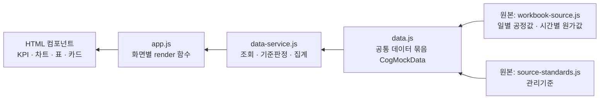

왜 중간 단계가 필요한가? 원본은 시간별/일별로 행이 많고 그대로는 읽기 어렵습니다. `data-service.js`가 선택 기간만 고르고, 기준과 비교하고, 합계를 낸 뒤 화면에 필요한 작은 결과로 바꿉니다.

| 문서에서 부르는 테이블 | 실제 코드의 변수 | 원본 파일 | 주요 컬럼 |
|---|---|---|---|
| 일별 공정 테이블 | `dailyObservations` | `workbook-source.js` → `data.js` | `period`, `timestamp`, `metrics.purifiedVolume`, `metrics.qualityContent`, `metrics.steamUsage` 등 |
| 관리기준 테이블 | `standards` | `source-standards.js` → `data.js` | `metricId`, `effectiveFrom`, `target`, `normalMin/Max`, `warningMin/Max` |
| 시간별 원가 테이블 | `costObservations` | `workbook-source.js` → `data.js` | `timestamp`, `gasQuantity`, `chemicalAUsage`, `chemicalBUsage`, `steamUsage` |
| 월별 원가 기준 테이블 | `monthlyCostImpacts` | `workbook-source.js` | 월, 원가항목, 목표량, 가상단가 (파일 내 열 순서도 지원) |
| 일별 판정 테이블 | `dailyStatuses` | `workbook-source.js` | `period`, `metricId`, `status` |
| 이벤트 테이블 | `events` | `workbook-source.js` → `data.js` | `id`, `name`, `startAt`, `endAt`, `impactedMetrics`, `priority` |

> 화면은 기본적으로 `화성공장 / COG 정제공정 / COG`와 선택한 조회 기간을 필터로 사용합니다. 원본이 없을 때만 `data.js`의 예비 합성값을 사용합니다.

---

## 1. 통합 현황

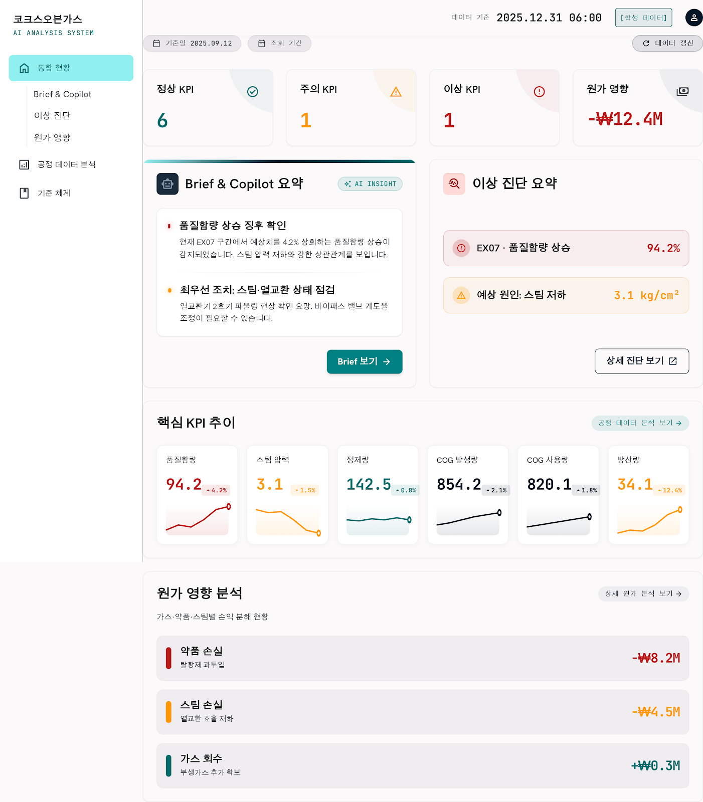

이미지에서 위에서 아래, 왼쪽에서 오른쪽으로 ①~⑤를 읽으면 됩니다. 화면 레퍼런스의 문구·배치는 현재 구현과 일부 다를 수 있지만, 아래 데이터 경로는 현재 코드 기준입니다.

### ① 정상·주의·이상 KPI 카드와 KPI 현황 표

- **무엇을 보여주나:** 마지막 날짜의 KPI 값과 정상/주의/이상 여부, 기준·목표와의 차이, 최근 추이입니다.
- **화면 → 데이터:** `KPI 현황 표`, 상태 카드, 핵심 KPI 스파크라인 → `getKpiSummaries(filters)` 결과 → `dailyObservations` + `standards`.
- **사용 컬럼:** `dailyObservations.period`, `metrics[metricId]`; `metricId`, `target`, `normalMin/Max`, `warningMin/Max`, `effectiveFrom`.
- **가공:** 선택 기간으로 일별 행을 고른 뒤 마지막 행을 현재값으로 사용합니다. `evaluateMetric()`이 정상 범위 밖이면 주의, 경고 범위까지 벗어나면 이상으로 분류합니다. `현재값 - 정상 경계`는 기준 대비, `현재값 - target`은 목표 대비입니다.
- **최종 컴포넌트:** `#overview .kpi-status-board` 표, `.metric-grid` KPI 카드, `.spark-grid` SVG 미니 추이.

### ② Brief & Copilot 요약

- **무엇을 보여주나:** 지금 가장 우선 확인할 문제와 다음 조치의 짧은 요약입니다.
- **화면 → 데이터:** Brief 카드 → KPI 요약 + 이벤트 정보 → `getKpiSummaries()` 및 `events`.
- **사용 컬럼:** `qualityContent`, `steamM01~steamM04`, `gasOutletTemp`, `equipmentPressure`; 이벤트의 `id`, `name`, `priority`.
- **가공:** 이상 KPI의 기준 이탈 폭을 계산하고 EX07 이벤트에 연결해 문장·점검 후보로 표시합니다. 이 문장은 “확정 원인”이 아니라 데이터에 근거한 점검 안내입니다.
- **최종 컴포넌트:** `.brief-card`, `.diagnosis-card`.

### ③ 핵심 KPI 추이

- **무엇을 보여주나:** 품질함량, 스팀 사용량, 정제량, 출구온도의 최근 변화입니다.
- **화면 → 데이터:** 각 미니 차트 → `getMetricSeries(metricId, filters)` → `dailyObservations`.
- **사용 컬럼:** 각 지표의 `metrics.qualityContent`, `steamUsage`, `purifiedVolume`, `gasOutletTemp`와 `period`.
- **가공:** 선택 기간의 값을 시간 순서대로 SVG 선의 좌표로 바꿉니다. 기준선/정상 음영은 같은 지표의 `standards`에서 가져옵니다.
- **최종 컴포넌트:** `.spark-grid`의 `.spark` 및 `trendSvg()`.

### ④ 선택 기간 손익 영향 KPI

- **무엇을 보여주나:** 선택 기간 전체의 손익 영향과 사용량/목표 차이입니다.
- **화면 → 데이터:** 손익 KPI → `getCostSummary(filters)` → `getCostRecords()` → `costObservations` + `monthlyCostImpacts`.
- **사용 컬럼:** `gasQuantity`, `chemicalAUsage`, `chemicalBUsage`, `steamUsage`, 월별 `목표량`, `가상단가`.
- **가공:** 시간별 목표량은 `월 목표량 ÷ 해당 월 실제 시간 수`로 나눕니다. 그 뒤 `(실제-목표) × 단가` 또는 절감 항목의 반대 부호 식으로 시간별 손익을 계산하고, 월·항목별로 합산합니다.
- **최종 컴포넌트:** `#overview .metric.cost`.

### ⑤ 손익 영향 분석 목록

- **무엇을 보여주나:** 가스·약품·스팀 중 어떤 항목이 손익을 만들었는지입니다.
- **화면 → 데이터:** 항목별 목록 → `groupCostByItem(filters)` → 월별 원가 레코드 → 시간별 원가/목표/단가 원본.
- **사용 컬럼:** 위 ④와 동일하며, 결과에서는 `costItem`, `actualUsage`, `targetUsage`, `actualProfitImpact`, `variance`를 사용합니다.
- **가공:** 같은 `costItem`의 기간 내 행을 합산합니다. 이 분해가 있어야 총액만 보고 원인을 놓치지 않습니다.
- **최종 컴포넌트:** `.cost-summary .cost-list`.

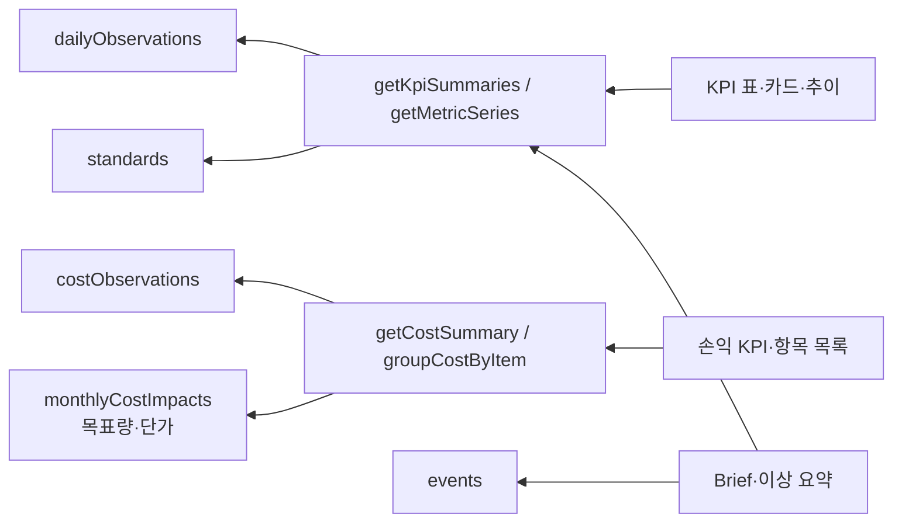

---

## 2. Brief & Copilot

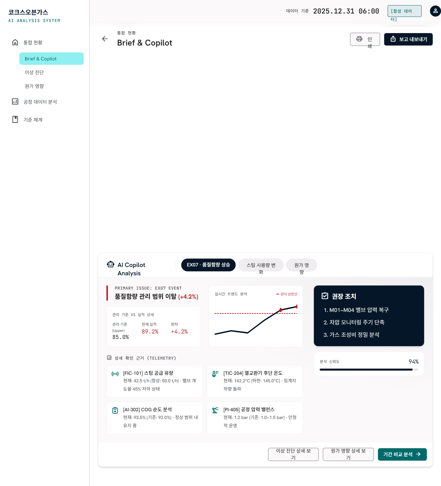

### ① 핵심 KPI 스냅샷·상태 요약

- **무엇을 보여주나:** 정상/주의/이상 건수와 대표 KPI의 현재 상태입니다.
- **데이터 → 화면:** `getKpiSummaries(dataDrivenState)` → `summaries` → `.brief-kpi-snapshot`, `.metric-strip`, 첫 번째 KPI 표.
- **컬럼/계산:** 일별 `metrics`의 마지막값을 기준표와 비교합니다. `status`별 개수를 세고, `value - target`, `value - 정상 경계`를 표시합니다.

### ② Copilot 이슈 설명과 확인 근거

- **무엇을 보여주나:** 선택한 칩(기본은 품질함량)에 대한 현재값·기준·이탈폭·점검 문장입니다.
- **데이터 → 화면:** `renderCopilotTopic(metricId)` → 해당 `summary` → `dailyObservations` + `standards`.
- **컬럼/계산:** 선택 KPI의 `value`, `series`, `standard.target`, 정상/경고 한계. `variance`와 `targetVariance`를 계산해 “왜 확인해야 하는지”를 짧게 설명합니다.
- **최종 컴포넌트:** `.copilot-grid`, `.inline-standard`, 확인 근거 목록.

### ③ 관련 지표 카드/추이

- **무엇을 보여주나:** 품질함량 주변의 스팀 M01~M04, 가스 출구온도, 설비 차압 등 연관 지표입니다.
- **데이터 → 화면:** KPI 요약 배열을 다시 필터링 → `trendSvg(item)` → `dailyObservations.metrics`.
- **컬럼/계산:** `steamM01`, `steamM02`, `steamM03`, `steamM04`, `gasOutletTemp`, `equipmentPressure`, `period`; 최근 값과 추이 선을 만듭니다.
- **최종 컴포넌트:** `.related-metrics`.

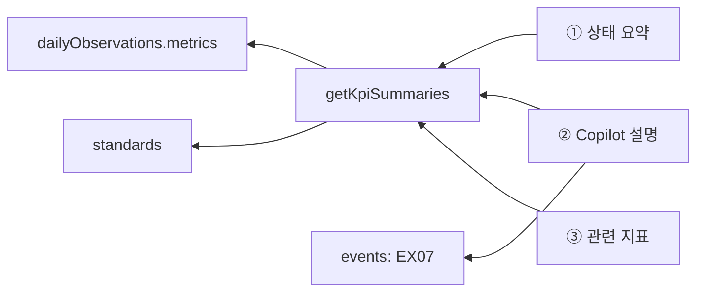

---

## 3. 공정 현황

### ① 선택 KPI 카드

- **무엇을 보여주나:** 선택한 기간의 각 공정 KPI 현재값·상태·짧은 추이입니다.
- **데이터 → 화면:** `renderProcessOverview()` → `getKpiSummaries(filters)` → `dailyObservations`, `standards`.
- **컬럼/계산:** 체크한 `metricId`별 `metrics[metricId]`, `period`, 기준 범위. 마지막 값을 카드에, 기간 전체를 SVG 추이에 사용합니다.
- **최종 컴포넌트:** `#processOverview .process-kpi-grid`.

### ② 일별 실적 표

- **무엇을 보여주나:** 날짜별로 선택한 지표의 원래 수치를 나란히 보는 표입니다.
- **데이터 → 화면:** `getObservations(filters)` → `dailyObservations` → `.process-data-table`.
- **컬럼/계산:** `period`와 체크된 `metrics[metricId]`. 표시 자리수만 `metricDefinitions.decimals`로 맞추며, 별도 합계나 예측은 하지 않습니다.

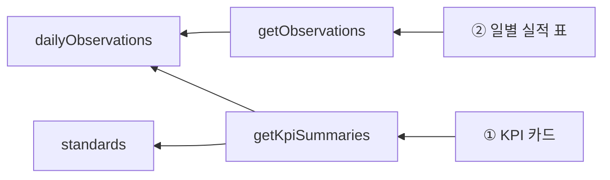

---

## 4. 이상 진단

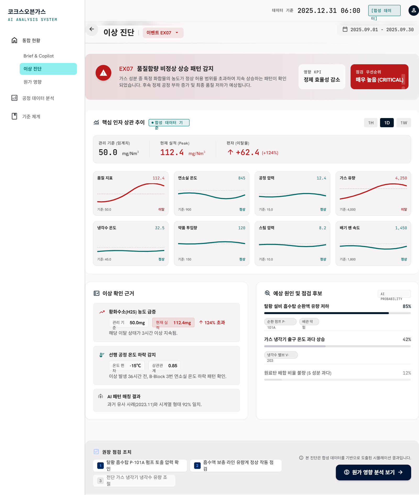

### ① 이벤트 헤더와 영향 KPI

- **무엇을 보여주나:** EX07 같은 이벤트의 이름, 영향 KPI, 점검 우선순위입니다.
- **데이터 → 화면:** `renderDiagnosisFromEvent()` → `getEvents(filters)` + `getPeriodIssues(filters)` → `events`, `dailyStatuses`, `dailyObservations`.
- **컬럼/계산:** 이벤트의 `id/name/startAt/endAt/priority/impactedMetrics`; 일별 판정의 `status`, `metricId`. 기간에 겹치는 이벤트만 고릅니다.
- **최종 컴포넌트:** `.danger-hero`, `.event-chip`.

### ② 핵심 지표 추이 차트

- **무엇을 보여주나:** 문제 KPI가 언제 기준을 넘었는지 보여주는 선 차트입니다.
- **데이터 → 화면:** 선택된 이상 KPI의 `summary.series` → `getMetricSeries()` → 일별 공정 테이블.
- **컬럼/계산:** `period`, 문제 지표의 `metrics[metricId]`, 기준의 `normalMax/Min`, `warningMax/Min`. 최근 8개 값을 SVG 좌표로 정규화합니다.
- **최종 컴포넌트:** `.trend-summary`, `.diagnosis-chart`.

### ③ 연관 지표·이상 근거·점검 후보

- **무엇을 보여주나:** 문제가 된 지표와 함께 볼 보조 지표, 이탈 사실, 우선 점검 내용입니다.
- **데이터 → 화면:** `getPeriodIssues()`의 `findingIds` → KPI 요약 → `related-metrics`·`evidence`·점검 카드.
- **컬럼/계산:** `dailyStatuses.status`가 있으면 그 판정을 우선 사용합니다. 없으면 각 일별 값에 `evaluateMetric()`을 적용해 비정상 지표를 찾습니다. 따라서 단순히 차트가 높아 보여서가 아니라 기준표와 비교한 결과를 사용합니다.
- **최종 컴포넌트:** `.related-metrics`, `.two-col`, `.checklist`.

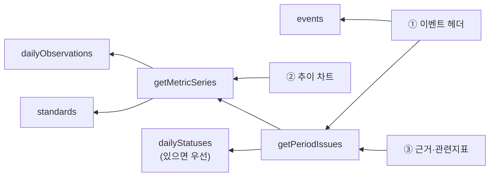

---

## 5. 손익 영향

### ① 총액·가스·약품·스팀 KPI 카드

- **무엇을 보여주나:** 기간 전체와 원가 항목별 손익 효과입니다.
- **데이터 → 화면:** `renderCostFromData()` → `getCostSummary()` / `groupCostByItem()` → 원가 레코드.
- **컬럼/계산:** 결과의 `actualProfitImpact`, `variance`, `actualUsage`, `targetUsage`, `costItem`. 총액은 모든 항목 합계입니다.
- **최종 컴포넌트:** `#cost .metric-grid .metric`.

### ② 사용량·목표 대비 막대

- **무엇을 보여주나:** 실제 사용량이 목표량보다 많은지/적은지입니다.
- **데이터 → 화면:** `groupCostByItem()` → `actualUsage`, `targetUsage`, `usageUnit` → `.usage-grid`.
- **컬럼/계산:** 시간별 사용량을 합산하고, 월 목표를 시간 단위 목표로 환산해 같은 기간 합계로 만듭니다. 막대 길이는 `actualUsage / targetUsage` 비율입니다.

### ③ 항목별·월별 손익 표/차트

- **무엇을 보여주나:** 항목별 합계와 월별 실제 손익(막대), 기준 손익(선)입니다.
- **데이터 → 화면:** `profitImpactData` → 항목·월별 `costRecords` → `.profit-impact-detail`, `.profit-item-charts`.
- **컬럼/계산:** `period`, `costItem`, `actualProfitImpact`, `baselineProfitImpact`, `variance`. 실제-기준이 `variance`이고, 선택 항목의 월별 행으로 SVG를 만듭니다.

### 계산식(원본 시간 1행 기준)

| 항목 | 사용량 컬럼 | 손익 영향식 |
|---|---|---|
| 가스 | `gasQuantity` | `(실제 가스량 - 시간당 목표) × 가스 단가 ÷ 1,000,000` |
| 약품 | `chemicalAUsage + chemicalBUsage` | `(목표 A-실제 A)×A단가 + (목표 B-실제 B)×B단가`, 이후 ÷ 1,000,000 |
| 스팀 | `steamUsage` | `(시간당 목표-실제 스팀량) × 스팀 단가 ÷ 1,000,000` |

부호 방향이 다른 이유는 사용량 증가가 항상 같은 의미가 아니기 때문입니다. 가스는 증가분을 비용으로 보고, 약품·스팀은 목표보다 적게 쓴 경우를 절감으로 계산합니다.

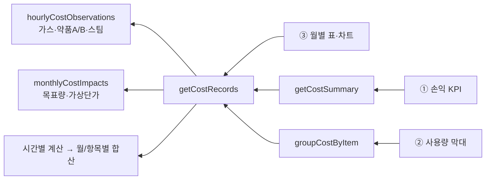

---

## 6. 공정 데이터 분석

### ① 기간 비교 결과 표와 최근 추이

- **무엇을 보여주나:** 기준 기간과 비교 기간의 평균값 차이, 최근 추이입니다.
- **데이터 → 화면:** `runProcessComparison()` → `getMetricSeries()` → `dailyObservations`.
- **컬럼/계산:** 선택한 `metricId`의 `metrics[metricId]`, `period`, 표시 정의의 `decimals/unit`. 각 기간의 평균을 낸 뒤 `기준기간 평균 - 비교기간 평균`을 계산합니다.
- **최종 컴포넌트:** `#process .result tbody`, `renderProcessRecentTrend()`.

### ② 관리기준 대비 분석 표

- **무엇을 보여주나:** 선택 기간 실적이 당시 관리기준에서 정상·주의·이상 중 어디인지입니다.
- **데이터 → 화면:** `renderProcessStandardAnalysis()` → KPI 요약 + 항목별 원가 집계 → 공정/원가 테이블.
- **컬럼/계산:** KPI는 `value`, `standard.effectiveFrom`, 정상·주의 한계, `variance`; 원가는 `targetUsage`, `actualUsage`, `variance`. 기준은 실적 날짜보다 늦지 않은 가장 최근 버전을 선택합니다.
- **최종 컴포넌트:** `.standard-comparison-result` 안의 두 표.

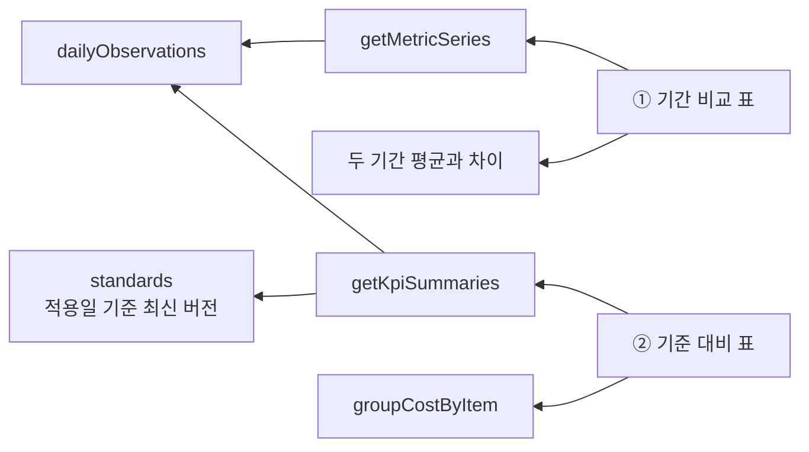

---

## 7. 기준 체계

### ① 관리 기준 조회 표

- **무엇을 보여주나:** 각 KPI의 정상 범위와 주의/이상 한계입니다.
- **데이터 → 화면:** `renderStandardsFromData()` → `metricDefinitions` + `getActiveStandard()` → `standards`.
- **컬럼/계산:** `metricId`, `label`, `unit`, `effectiveFrom`, `normalMin/Max`, `warningMin/Max`. 조회 기준일 이전의 행 중 가장 늦은 `effectiveFrom`을 골라 표시합니다.
- **최종 컴포넌트:** `#standards .standards-grid`의 첫 번째 표.

### ② 기준 변경 이력

- **무엇을 보여주나:** 언제 어떤 기준 버전이 적용되었는지입니다.
- **데이터 → 화면:** `standards` 전체를 `effectiveFrom` 내림차순 정렬 → 변경 이력 표.
- **컬럼/계산:** `effectiveFrom`, `metricId`와 `metricDefinitions.label`. 과거 데이터를 과거 기준으로 판단할 수 있게 남기는 정보입니다.
- **최종 컴포넌트:** 두 번째 이력 표.

### ③ 이상 판정 규칙 안내

- **무엇을 보여주나:** 정상→주의→이상으로 판단하는 업무 규칙 설명입니다.
- **데이터 → 화면:** 현재는 `index.html`에 안내 문구로 작성된 정적 컴포넌트입니다.
- **주의:** 실제 수치 판정은 `data-service.js`의 `evaluateMetric()`이 기준 범위로 수행합니다. 즉, 이 영역은 규칙을 설명하고, 실제 상태값은 일별 공정값과 기준 테이블에서 나옵니다.
- **최종 컴포넌트:** `.rules`.

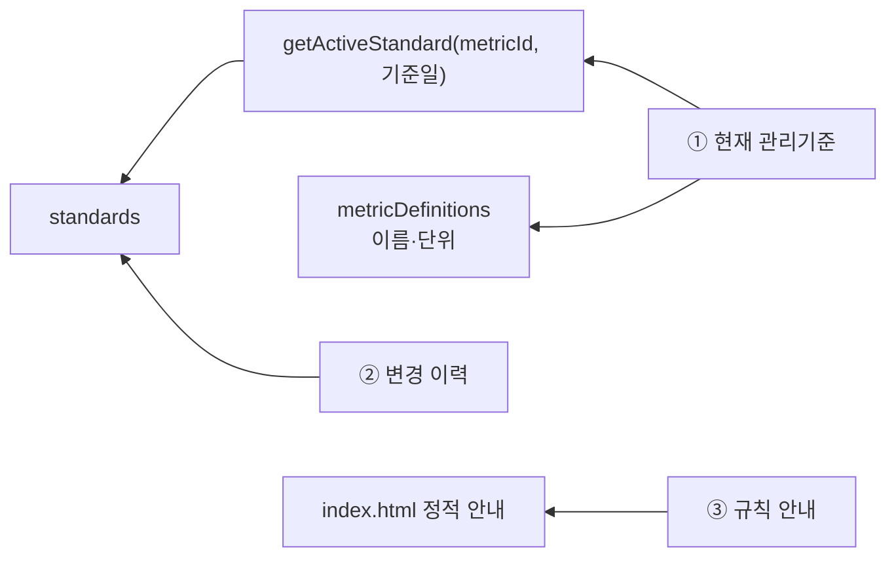

---

## 초보자를 위한 한 줄 요약

화면의 숫자는 대부분 **일별 공정 테이블의 마지막 값**에서 시작하고, 기준 테이블을 붙여 상태를 판정합니다. 손익 화면만 별도로 **시간별 사용량 × 월별 목표/단가**를 계산해 합산합니다. 즉, 화면은 원본을 직접 읽지 않고, `data-service.js`가 “조회·비교·합계”를 마친 결과를 받아 보기 좋게 그립니다.

## 분석 범위와 확인 파일

- 화면 구조: `frontend/index.html`
- 화면 렌더링·계산 연결: `frontend/app.js`
- 조회·판정·집계: `frontend/data-service.js`
- 공통 데이터 모델: `frontend/data.js`
- 실제 원본 데이터 적재본: `frontend/workbook-source.js`, `frontend/source-standards.js`
- 화면 레퍼런스: `stitch_ai/kpi/screen.png`, `stitch_ai/brief_copilot/screen.png`, `stitch_ai/_1/screen.png`
